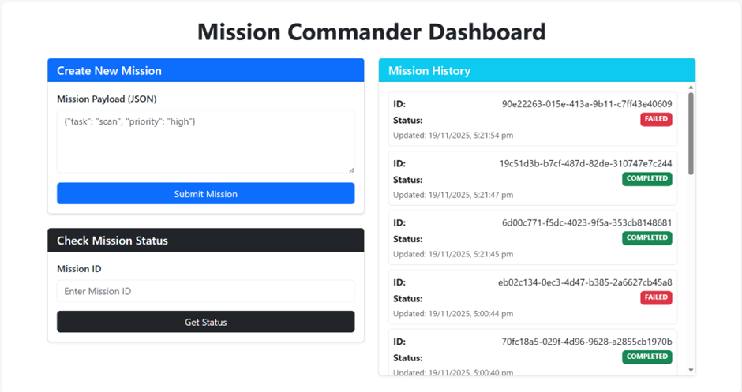
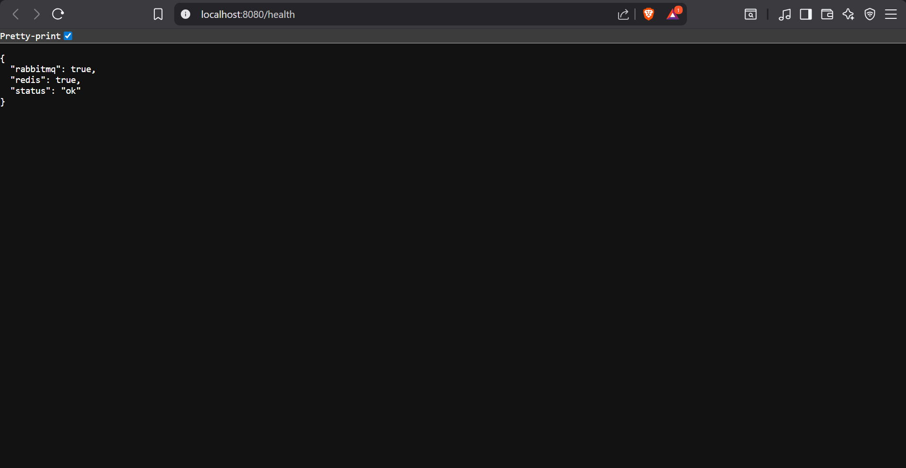
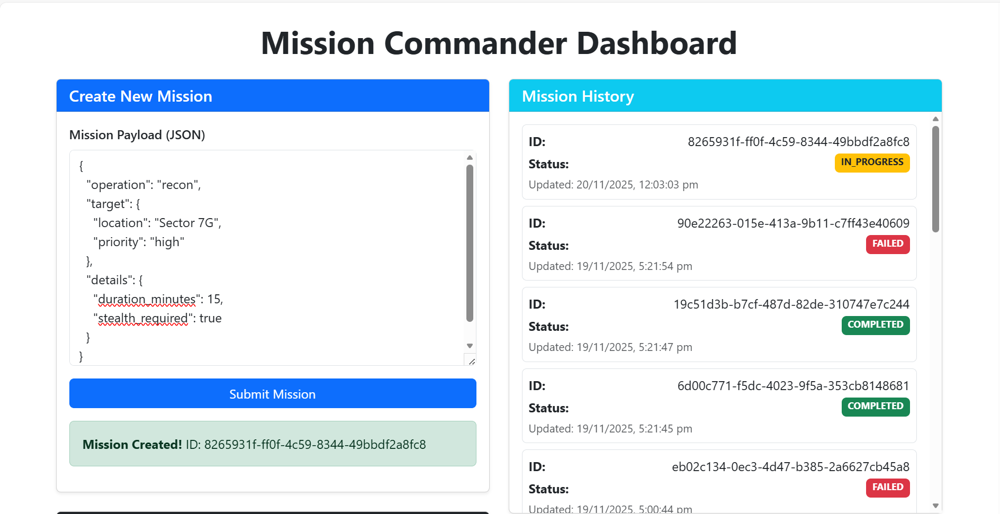
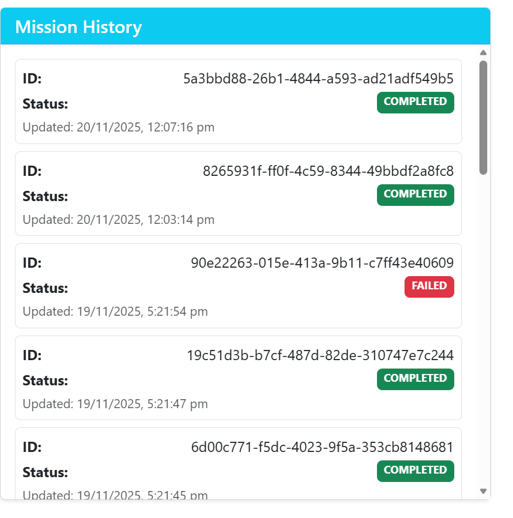
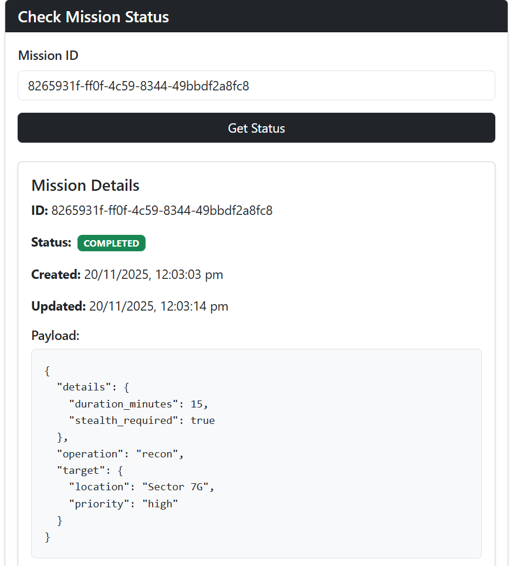
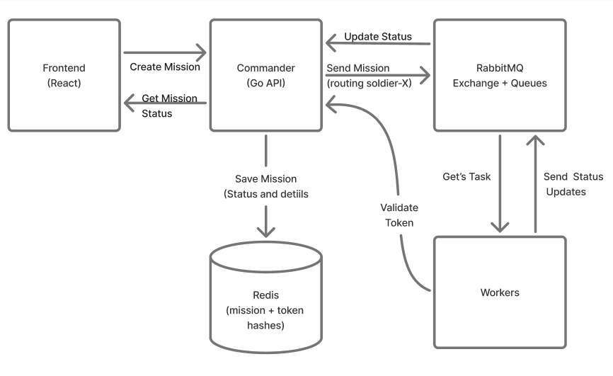
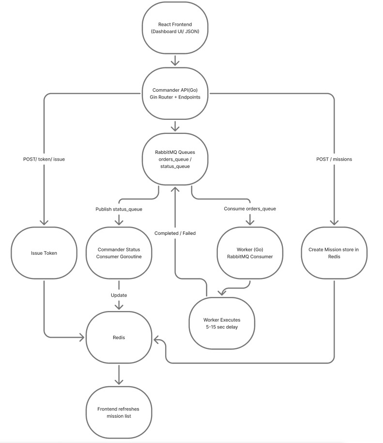

# Mission Control Project

Mission Control is a distributed mission management system implemented in Golang, designed to simulate secure military-style command operations. The system allows the Commander (API) to issue missions, queue them asynchronously, and monitor real-time progress as worker units execute tasks on the Battlefield.


## The architecture uses:

- Go (Golang) for the Commander API and Worker Services  
- RabbitMQ for workload distribution  
- Redis for mission persistence and status tracking  
- React for mission visualization  
- Docker Compose for full-service containerization and scaling


## System Overview

### Figure 1: Frontend
The React dashboard allows commanders to submit missions, monitor real-time status, and inspect individual mission details.

 


## Setup Instructions

### Quick Start

Start the entire system using Docker Compose:

```bash
docker-compose up --build
```

Access the application:

    Frontend: http://localhost:3000

    API (Go Commander): http://localhost:5000


## Services Overview

| Service        | Technology     | Port           | Description                                               |
|----------------|----------------|----------------|-----------------------------------------------------------|
| Commander (API) | Go (Golang)    | 8080           | Issues missions, validates tokens, updates mission status |
| Workers        | Go (Golang)    | —              | 3 replicated instances to execute missions                |
| Redis          | Redis          | 6379           | Stores mission metadata, status, timestamps               |
| RabbitMQ       | RabbitMQ       | 5672 / 15672   | Message broker for mission distribution & status routing  |
| Frontend       | React + Vite   | 3000           | Mission dashboard UI                                      |

---

## Health Check

Verify all systems are running:

 

## Authentication

The system uses token-based authentication with automatic rotation every 30 seconds.  
All workers must present a valid token when sending mission status updates.

### POST /auth/token
Generate a new API token for worker authentication.

---

## Core Endpoints

### GET /health
Check if all services (Redis, RabbitMQ, Workers) are operational.

### POST /missions
Submit a new mission.  
The Commander will:
- generate a mission ID  
- store mission data in Redis  
- push mission ID to RabbitMQ  

---

### Figure 4: Mission Creation
 

### GET /missions
Retrieve all missions with their current status.

#### Figure 5: Mission Info


---

### GET /missions/{mission_id}


## Mission Status Flow

| Status       | Meaning                                               |
|--------------|--------------------------------------------------------|
| QUEUED       | Mission stored in Redis, waiting in RabbitMQ           |
| IN_PROGRESS  | Worker picked it up and started execution              |
| COMPLETED    | Worker completed mission                               |
| FAILED       | Worker failed mission execution                        |

## Technology Decisions

| Component      | Technology      | Rationale                                          |
|----------------|-----------------|----------------------------------------------------|
| Backend API    | Go (Golang)     | High performance, concurrency via goroutines       |
| Persistence    | Redis           | In-memory fast updates for mission status          |
| Frontend       | React + Bootstrap      | Interactive UI, real-time visualization            |
| Message Broker | RabbitMQ        | Reliable queueing, worker scaling, durability      |
| Containerization | Docker        | Easy scaling, consistent environment               |
| Message Format | JSON            | Simple, universal, human-readable                  |
| Worker Scaling | Docker Compose replicas | Horizontal scaling without Kubernetes      |

## Message Queue: RabbitMQ

### Rationale for RabbitMQ Selection
- **Reliability**: Durable queues + acknowledgments prevent loss of mission commands.
- **Scalability**: Multiple workers consume from the same queue → automatic load balancing.
- **Persistence**: Messages survive broker restarts.
- **Mature ecosystem**: Widely used and highly stable for distributed systems.

---

## RabbitMQ Configuration Details

### Queue Durability
All queues are declared as **durable**, ensuring they survive broker restarts.

### Message Persistence
Messages are **persisted to disk** before acknowledgment, preventing loss during worker failures.

### Connection Management
Workers implement:
- Automatic **reconnect loops**  
- Exponential **backoff** on failure  
- Graceful shutdown handling  
- Proper `Ack` / `Nack` strategies to ensure message safety

## Queue Architecture

    Commander API (Go)
       ↓ publishes
    orders_queue (durable)
        ↓ consumed by
    Worker Units (Go)
        ↓ publish updates
    status_queue (durable)
        ↓ consumed by
    Commander API
---

## Authentication & Identity Management: Token Rotation

The Go Commander generates secure, UUID-based tokens.

### Token Characteristics
- **Type:** UUID4  
- **TTL:** 30 seconds  
- **Refresh interval:** 25 seconds  
- **Grace period:** 5 seconds  
- **Storage:** Thread-safe (Go sync primitives)


## Token Generation Example (Go)

```go
func GenerateToken() (string, time.Time) {
    token := uuid.New().String()
    expiry := time.Now().Add(time.Duration(TOKEN_ROTATION_INTERVAL) * time.Second)
    tokenStore[token] = expiry
    cleanupExpiredTokens()
    return token, expiry
}
```

## Token Validation Example

```go
key := fmt.Sprintf("token:%s", s.Token)
		val, err := redisCli.Get(ctx, key).Result()
		if err != nil {
			log.Printf("token validation failed for token=%s : %v", s.Token, err)
			continue
		}
```

### Worker Token Refresh Behavior

- Background goroutine refreshes token every 25 seconds
- Ensures uninterrupted mission processing
- No downtime during rotation


### Architecture Overview

Mission Control implements a one-way secure command system:

- Workers NEVER expose public endpoints
- Workers pull missions from RabbitMQ
- All updates go back through status_queue
- Commander persists everything in Redis



### Core Components
1. Commander (Go API)

Responsibilities:

- Mission creation
- Storing missions in Redis
- Publishing mission IDs to orders_queue
- Listening to status_queue
- Updating mission statuses
- Serving frontend API requests

2. Worker Units (Go)

Responsibilities:

- Poll RabbitMQ for mission IDs
- Fetch mission details from Redis
- Execute mission (5–15 sec simulation)
- Update status queue with tokens
- Refresh tokens automatically
- No inbound connections needed

3. Message Broker (RabbitMQ)

- orders_queue: Commander → Workers
- status_queue: Workers → Commander
- Durable, persistent, fault-tolerant

4. Mission Persistence (Redis)

Stores:

- mission ID
- type
- payload
- status
- timestamps
Perfect for real-time updates.

5. Mission Dashboard (Frontend - React)

- Submit missions
- View mission list
- Real-time status
- Mission detail pages
## Data Flow

1. Client submits mission  
2. API stores mission in Redis  
3. API publishes mission ID to RabbitMQ  
4. Worker consumes → marks IN_PROGRESS  
5. Worker simulates mission (5–15 sec)  
6. Worker publishes COMPLETED/FAILED  
7. Commander updates Redis  
8. Client polls /missions for updates  

 


## Mission Success Rate & Testing Summary

### Success Rate Configuration (Workers)
In `worker.go`:

```go
const SUCCESS_RATE = 0.9
```

## Automated Mission Testing

Includes:

- Single mission test
- 20 concurrent mission stress test
- Token rotation test
- Worker failure simulation
- Log generation

## AI Usage Policy
AI Tools Used

- Architecture drafting
- Initial Go boilerplate for Gin handlers & RabbitMQ setup
- Test script generation
- README formatting
- Error-handling patterns
